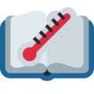

<!-- Improved compatibility of back to top link: See: https://github.com/othneildrew/Best-README-Template/pull/73 -->
<a name="readme-top"></a>

<!-- PROJECT SHIELDS -->
<!--
*** I'm using markdown "reference style" links for readability.
*** Reference links are enclosed in brackets [ ] instead of parentheses ( ).
*** See the bottom of this document for the declaration of the reference variables
*** for contributors-url, forks-url, etc. This is an optional, concise syntax you may use.
*** https://www.markdownguide.org/basic-syntax/#reference-style-links
-->
<div align="center">
[![MIT License][license-shield]][license-url]
[![LinkedIn][linkedin-shield]][linkedin-url]
[![Website][website-shield]][website-url]
</div>

<div align="center">
  <a href="https://github.com/othneildrew/Best-README-Template">
    
  </a>

  <h3 align="center">Perry's thesis-o-meter</h3>

  <p align="center">
    A slipshod LaTeX thesis progress monitoring tool
    <br />
  </p>
</div>

<!-- ABOUT THE PROJECT -->
## About The Project

This repository contains the basic tooling I used to keep track of my writing progress for my PhD thesis, when I started focusing on write-up in 2023.

I am [not](https://gousios.org/sw/tom.html) the first person to have this idea, and [this letter](https://web.archive.org/web/20060823213221/https://www.cl.cam.ac.uk/~akw27/thesisometer-explained.txt) explains the how and why.

I found [another tool](https://github.com/joapaspe/tesismometro) which does something similar, however the setup seemed a bit complex for something that I could easily do myself, especially if I wanted to hack and add extra parts.

Thus, this repository was born.
Feel free to use it as is, or adapt for your own needs, it's under the MIT license.
I've build it under the assumption that you're using a Linux-like environment, with Python.

The system is enabled by other free open tools:
- [opendetex](https://github.com/pkubowicz/opendetex): for getting approximate plaintext from a LaTeX project.
- [GitPython](https://gitpython.readthedocs.io/en/stable/): for automatically pulling new project updates.

## Roadmap

- [x] Add word count
- [x] Add conservative logging (only log on update)
- [x] Add automatic git pull
- [x] Add automatic pdflatex build
- [x] Extract page count
- [ ] Extract number of references
- [ ] Extract number of figures
- [ ] Give more info with breakdown (e.g., number of sections/chapters, words per section/chapter)

## Critique

Features I like about my system:
- will only save data if there has been a change since the last update
- some of the code was written by `code-davinci-002` (e.g. `get_timestamp()` and `get_most_recent_file()`): why should easily verified non-critical path code be written by a human?

Features I don't like about my system:
- It relies on using non-Python shell packages, called via `subprocess`, which has some issues
  - Is not very "pythonic", and less portable
  - Does not take advantage of Python's package manager, and I'm not pinning versions
  - Thus, outputs and invocation of the tools used may change and the tool will throw errors
- The documentation is still pretty spotty

## Install requirements

### opendex
Setup [opendetex](https://github.com/pkubowicz/opendetex), which is used to get a word count:

``` sh
git clone https://github.com/pkubowicz/opendetex
sudo apt-get install make gcc flex
cd third_party/opendetex
make
sudo make install
```

### git management

The code assumes your LaTeX project is a git repo (which if it is not, it probably should be).
If you are using Overleaf, you can clone using git in the settings in the menu on the left.

For this tool to be automated, you should ensure that your git credentials for your repo are stashed, so you do not need to enter them every time.
If using Overleaf or HTTPS, you could run from within your thesis directory:

```
git config --local credential.helper store
```
And then run `git pull` and enter your details one more time.

However, there are some security implications to doing this, as it will store your credentials in clear text in a local file (`.git-credentials`) under your project directory.
If you are using GitHub, GitLab, or similar, you could create a deployment key, which can mitigate a lot of the security risks.
Alternatively, you can leverage a credential manager to store things, see this [StackOverflow post](https://stackoverflow.com/a/5343146/6267719).

### LaTeX tools

Some extensions may require to compile your document with LaTeX to extract useful info (e.g., number of pages).
If you're using Overleaf, then it may be irritating to set it up to be exactly the same compilation pipeline on the machine you're running this tool.
If you accept that your numbers will be an estimate, you can save yourself some headaches.

TeX-live can be pretty large, so you may want to install a stripped down version (~200MiB).
```
apt-get install texlive-latex-base
```

You can check if you need any other packages by running `pdflatex $MAIN_TEX_FILE` and noting what failed.
For me I had to install `texlive-fonts-recommended` too, and then after chasing another missing package for a minute realised that I was fine using 6GiB with the full `texlive-full` package if it meant I could get back to work.

## Run the tool

For a basic run, the script can be invoked with:

``` sh
python3 thesis-o-meter.py \
    --git_dir $YOUR_THESIS_DIR \
    --main_tex $YOUR_MAIN_FILE \
    --log_dir $YOUR_CHOSEN_LOG_DIR
```

However, since this is about longer term measurement, you will want probably want to have it run as a cronjob (i.e., automatically, periodically).

Run `crontab -e`, and add the invocation to the bash script, for example to run the script every hour.

``` sh
0 */1 * * * bash $SOME_DIR/crontab/$SOME_SCRIPT
```

## Acknowledgments

- [opendetex](https://github.com/pkubowicz/opendetex/): approximate word count from LaTeX


<!-- MARKDOWN LINKS & IMAGES -->
<!-- https://www.markdownguide.org/basic-syntax/#reference-style-links -->
[license-shield]: https://img.shields.io/github/license/othneildrew/Best-README-Template.svg?style=for-the-badge
[license-url]: https://github.com/Wheest/thesis-o-meter/blob/main/LICENSE
[contributors-shield]: https://img.shields.io/github/contributors/othneildrew/Best-README-Template.svg?style=for-the-badge
[contributors-url]: https://github.com/Wheest/thesis-o-meter/graphs/contributors
[forks-shield]: https://img.shields.io/github/forks/othneildrew/Best-README-Template.svg?style=for-the-badge
[forks-url]: https://github.com/Wheest/thesis-o-meter/network/members
[stars-shield]: https://img.shields.io/github/stars/othneildrew/Best-README-Template.svg?style=for-the-badge
[stars-url]: https://github.com/Wheest/thesis-o-meter/stargazers
[linkedin-shield]: https://img.shields.io/badge/-LinkedIn-black.svg?style=for-the-badge&logo=linkedin&colorB=555
[linkedin-url]: https://www.linkedin.com/in/perry-gibson/
[website-shield]:
https://img.shields.io/badge/website-gibsonic.org-brightgreen?style=for-the-badge&logo=appveyor
[website-url]: https://www.gibsonc.org/
